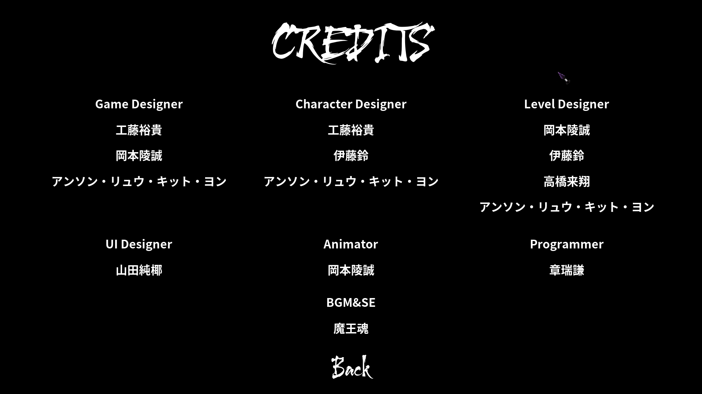
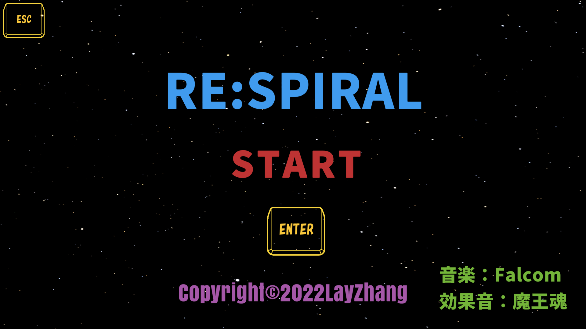
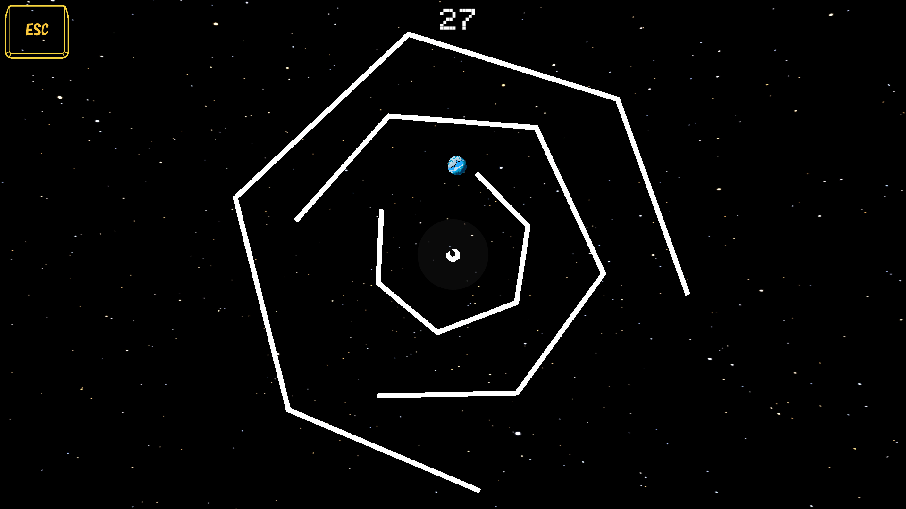

# portfolio
- 章瑞謙
- 連絡先 Email [laybaekzhang@gmail.com](mailto:laybaekzhang@gmail.com)
- 専門学校デジタルアーツ東京 ゲームプログラムコース 2024年3月卒業
- 中国浙江省　杭州電子科技大学 2018年6月 学士卒業

## 資格
- 日本語能力試験一級
- TOEIC 600点以上
- ビジネスジョブパス三級

## スキル
- Unreal Engine 
  - 利用歴1年
  - チーム作品の開発経験あり
- Unity
  - 利用歴1年
  - オリジナル作品の開発経験あり
- C/C++
  - 利用歴1年
  - コンソールで簡単なデータ処理プログラムを開発
- C#
  - 利用歴1年
  - Visual Studioで独自のツールの作成が可能

## 取り組んでいるテーマ
- Unreal Engineでチーム作品開発
- Unityでオリジナルゲーム開発

## 作品リスト
### 疾陰の駆者

Demo video：[Yotube](https://www.youtube.com/watch?v=XAqnbhxmeEE)

DEMO download：[Freem](https://www.freem.ne.jp/win/game/32196)

- 開発環境：Unreal Engine 5
- 開発期間：三ヶ月

### 避け取る　荒れの森

マウスで開始、矢印で動き、敵避け、コインを取る

Play now：[Unityroom](https://unityroom.com/games/yoketoru2022-sample)

Project File: [GoogleDrive](https://drive.google.com/file/d/1nnGnUKpNW8A4In_65O2oMX9j4dSbE-Ye/view?usp=sharing)

- 開発環境：Unity
- 開発期間：一週間

### RESPIRAL

Enterで開始、矢印あるいはWASDで動き、線を避け、時間内生きる

Play now：[Unityroom](https://unityroom.com/games/RESPIRAL-sample)

Project File: [GoogleDrive](https://drive.google.com/file/d/14UqUMc_fBUVO-SXgA2mmnGDFJtdCX1Km/view?usp=sharing)

- 開発環境：Unity
- 開発期間：一日

## 連絡先
- E-mail [laybaekzhang@gmail.com](mailto:laybaekzhang@gmail.com)

